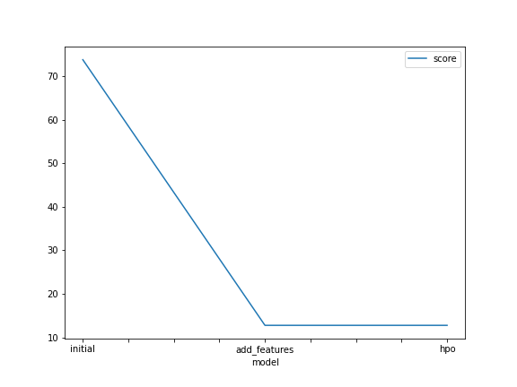
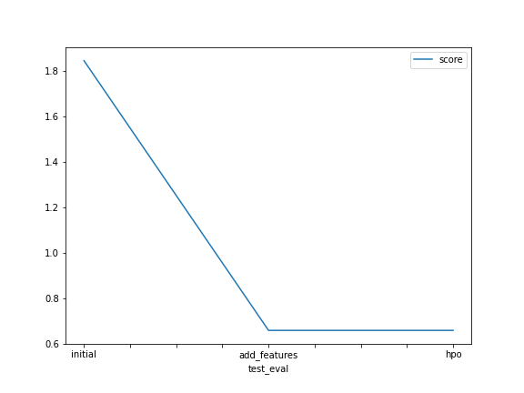

# Report: Predict Bike Sharing Demand with AutoGluon Solution
Mohamed Mohamed Eladib

## Initial Training
### What did you realize when you tried to submit your predictions? What changes were needed to the output of the predictor to submit your results?
it is not allowed to have any value below zero so that you could substitute such a negative value with zero.

### What was the top ranked model that performed?
Weighted Ensemble L3 is the best model so far, in default, new features, and HPO strategy.

## Exploratory data analysis and feature creation
### What did the exploratory analysis find and how did you add additional features?
First of all, I plotted all features using histogram plots. And I've found that numerical features, i.e. temp, and humidity temp to resemble normal distribution, whereas the windspeed is  left skewed.

For the datetime column, it is much better to split it into more Numeric value, i.e. year, month, day, and hour.

### How much better did your model preform after adding additional features and why do you think that is?
It improved significantly. In model evaluation and Kaggle result, the error metric gets 4 times smaller.
The reasons behind this major improvement are as follows:
1.Setting some feature as categories help alot
2 Bsplitting datetime, we could collect year, month, day, and hour. Each has its unique behavior.

## Hyper parameter tuning
### How much better did your model preform after trying different hyper parameters?
Almost nothing changed.

### If you were given more time with this dataset, where do you think you would spend more time?
Featuring engineering for dataset as getting worse with time

### Create a table with the models you ran, the hyperparameters modified, and the kaggle score.
|model|time_limit|presets|auto_stack|scheduler|searcher||num_bag_folds|num_bag_sets|trials|num_stack_levels|score|
|---|---|---|---|---|---|---|---|---|---|---|
|initial|600|Best Quality|default|default|default|default|default|default|default|default|1.84|
|add_features|600|Best Quality|default|default|default|default|default|default|default|default|0.6588|
|hpo|900|Best Quality|true|local|auto|10|4|9|4|4|0.6588|

|model|hpo1|hpo2|hpo3|hpo4|score|

### Create a line plot showing the top model score for the three (or more) training runs during the project.

TODO: Replace the image below with your own.

### Create a line plot showing the top kaggle score for the three (or more) prediction submissions during the project.

TODO: Replace the image below with your own.

## Summary
the provided dataset has been clean,So it is unnecessary to perform data cleansing. Instead, adjusting column data types is the one implemented.
Make sure the dataset.the addition of new features and the correct categorisation  drastically improved model performance.
As a result the model performance increase from 1.84 to 0.654 
The last strategy is to optimize model hyperparameters. And the metric score almost does not changes.

